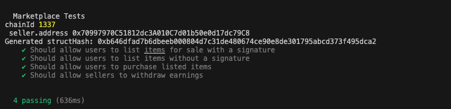

# Smart Contract Marketplace #

This project implements a marketplace smart contract where users can:

- List ERC-20 tokens for sale at a specified price in Ether.

- Purchase listed tokens by sending the required Ether.

- Withdraw their Ether earnings from the marketplace.

- Interact with the marketplace using EIP-712 signed messages for token transfers and pre-authorized listings.

The project uses the Hardhat framework for development, testing, and deployment.

## Smart Contract deployed (VERIFIED)

https://sepolia.etherscan.io/address/0x51283B4032ce0F7fdcAfF3Ac0c8005aA1Cb47a61#code

## Screenshots tests




## Prerequisites ##

- Node.js (v21 or later)
- npm
- Hardhat


## Installation ##

```bash
git clone <repository-url>
cd marketplace-hardhat
npm install
```


## Compile Contracts ##

```bash
npm run compile
```

## Run a Local Node ##

```bash
npm run node
```

## Deploy Contracts ##

```bash
npm run deploy
```

## run tests ##

```bash
npm run test
```
